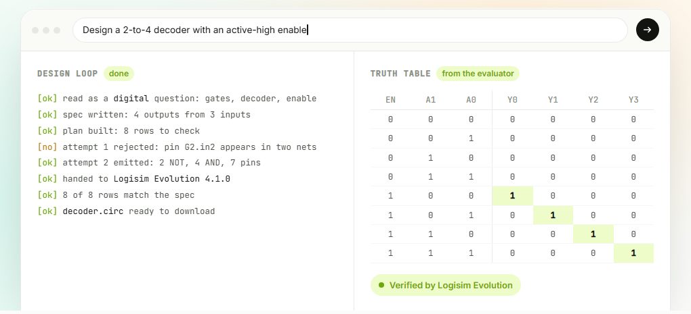
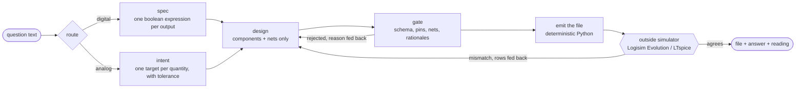

<div align="center">


# Ohmwork

**Type an electronics-lab question in plain English. Get the circuit file and the answer, checked by a real simulator.**

[](https://github.com/ShaanGS/ohmwork/actions/workflows/ci.yml)
[](https://github.com/ShaanGS/ohmwork/actions/workflows/docker.yml)
[](https://github.com/ShaanGS/ohmwork/releases/latest)
[](pyproject.toml)
[](LICENSE)
[](https://github.com/ShaanGS/ohmwork/stargazers)

[**Download for Windows**](https://github.com/ShaanGS/ohmwork/releases/latest/download/Ohmwork.Setup.0.1.1.exe) · [Website](https://shaangs.github.io/ohmwork/) · [Solved library](https://shaangs.github.io/ohmwork/library/) · [Architecture](ARCHITECTURE.md) · [Product spec](PRD.md)

<br />



<sub>A real solve, replayed: one design rejected, one accepted, every row of the table computed by Logisim Evolution from the file you download.</sub>

</div>

<br />

## Why this exists

Every ECE lab manual ends an experiment with an *open-ended question*: "design a 4-to-2 priority encoder with enable", "calculate the line and load regulation of the regulator shown". They are ungraded, nothing is submitted, and they are the only part of the lab where you actually have to think.

A language model can write you a netlist for any of them in three seconds. It can also be **confidently wrong**, and a wrong circuit simulates just as happily as a right one. Ohmwork exists to close that gap: the model may only *propose* a circuit. An outside simulator decides whether it is right, and nothing reaches you unless it agreed.

<table>
<tr>
<td width="33%" valign="top">

### ⚡ Digital
Logisim `.circ` files from AND, OR, NAND, NOR, XOR, XNOR and NOT gates (2, 3, 4 and 8 inputs), or with real ICs (a 7447 and a seven-segment display). "Using NAND gates only" is read from the question and enforced. **Every row** of the truth table is computed by Logisim Evolution from the emitted file and compared against the spec.

</td>
<td width="33%" valign="top">

### 〜 Analog
LTspice `.asc` files with a **human-style schematic**: routed wires, ground rail, labelled nodes. DC operating points, sweeps and transients run in LTspice itself, and the numbers the question named are checked against it.

</td>
<td width="33%" valign="top">

### 🛡️ Honest
Four outcomes, four looks. **Verified** and **measured** are different words because they are different claims. A question in the wrong domain is **refused**, not bluffed. A wrong design dies in private and is redone.

</td>
</tr>
</table>

## Quick start

### The desktop app (Windows)

1. [Download the installer](https://github.com/ShaanGS/ohmwork/releases/latest/download/Ohmwork.Setup.0.1.1.exe). It is not code-signed yet: at the SmartScreen prompt pick **More info → Run anyway**. If your PC has Smart App Control turned **on**, Windows blocks every unsigned installer with no override, and Ohmwork will not run there until a signed build ships. The installer bundles Logisim Evolution 4.1.0 (GPL-3.0; source at the [logisim-evolution](https://github.com/logisim-evolution/logisim-evolution) repository).
2. Paste a free model key (Groq, Mistral, Gemini, OpenRouter or Cerebras) into the key box. It is encrypted with your Windows account's own key (DPAPI, via Electron's `safeStorage`) and written to a file only you can read. It never reaches the page and is never uploaded by Ohmwork. An Anthropic key works from the command line (`ANTHROPIC_API_KEY` plus the `[anthropic]` extra), not yet from the app's key box.
3. Have LTspice installed if you want analog questions. Logisim Evolution is **bundled**, pinned to 4.1.0.
4. Type the question. Read the **reading** the app prints first (that is the one check only you can do), then take the file.

### From source

```bash
git clone https://github.com/ShaanGS/ohmwork && cd ohmwork
pip install -e ".[llm]"
cp .env.example .env          # put your key in it
```

```bash
python -m ohmwork --solve "Design a 2-to-4 decoder with an active-high enable"
python -m ohmwork --solve "Design a series voltage regulator in LTspice that delivers 9 V to a 1k load from a 15 V supply"
```

The CLI says which half it routed the question to and why, streams every rejected design attempt with the reason, and prints the reading above the answer.

<details>
<summary><b>Run the web app locally</b></summary>

```bash
pip install -e ".[web,llm]"
cd web && npm install && npm run build && cd ..
OHMWORK_PASSWORD=whatever python -m ohmwork.server
```

This is the same server the desktop app wraps. Both halves are served: digital needs Logisim Evolution on the path (or `OHMWORK_LOGISIM`), analog needs LTspice (or `OHMWORK_LTSPICE`). Without LTspice an analog question is refused naming the download, never answered unverified.

</details>

## How it works



The model writes **intent only**: expressions, components, nets. It never writes coordinates and never writes the thing that gets simulated. The emitter places and routes deterministically, the simulator is handed **that file**, and the result is read back out of what the simulator produced. A design the simulator disagrees with is thrown away and redone. If none survives, you get an error and no file.

The reason for the rule is not hypothetical. In the first hours of this project a model produced a SPICE netlist and an LTspice schematic side by side. Both looked fine. The netlist had the zener correctly as a shunt; the schematic had it forward-biased. Nothing disagreed, because nothing compared them.

### What each outcome means

| outcome | you see | what was established |
|---|---|---|
| **Verified** | green | every row of an exhaustive truth table, computed by Logisim from the emitted file, matches the spec |
| **Measured** | lime, weaker on purpose | the circuit converged in LTspice, its devices stayed in regime (zener in breakdown, BJT active), and the figures the question *named* came out inside tolerance |
| **Refused** | amber | the question is outside what this loop can check (an analog question typed into the digital loop, say), and the evidence is quoted |
| **Unavailable** | grey | no model provider could answer right now; nothing about your question is implied |

A measured result also prints what is **not** established: that it is a *good* design. A regulator that hits 9.00 V while dissipating six watts in the pass transistor passes every check here. Correct truth-table rows are the whole answer; correct measurements are not.

## A worked example, with real numbers

`examples/q1_anchored.json`, transcribed by a human from a screenshot of the lab manual:

> Calculate the output voltage in both load and line regulation and Zener diode current in the regulator circuit shown below using LTspice.

15 V in, 1.8 kΩ series resistor, 8.3 V zener from base to ground, an NPN pass transistor with β = 100, 2 kΩ load.

```bash
python -m ohmwork examples/q1_anchored.json --dry-run   # prints every value for you to check, then stops
python -m ohmwork examples/q1_anchored.json             # emits the .asc, runs LTspice on it, reports
```

| quantity | value |
|---|---|
| output voltage at 15 V in, 2 kΩ load | **7.48403 V** |
| base node `vb` | **8.29214 V** |
| zener current | **3.68954 mA** |
| line regulation, 12 V → 20 V in | **0.399224 %** |
| load regulation, 100 kΩ → 500 Ω | **1.847626 %** |

Provenance: LTspice 26.0.2.1, `-b -ascii`, measured 2026-08-24. Every number is pinned in [`tests/baselines.py`](tests/baselines.py) with backend, version, date and generating command, and [`tests/test_readme.py`](tests/test_readme.py) checks this table against those pins. A bare float as an expected simulation value is banned in this repo.

**The part worth a student's time:** across the full load sweep, `vb` moves from 8.292391 V to 8.291356 V, about **1 mV**, while `vout` drops from 7.585122 V to 7.447520 V, about **138 mV**. The output moves 133 times further than the node that is supposed to be setting it. Essentially none of this regulator's load regulation comes from the zener sagging. It is V<sub>BE</sub> rising with emitter current. That falls out of the sweep data, and it answers the question in a way a percentage does not.

<details>
<summary><b>Why the zener is a synthesised model, and why <code>D(BV=8.3)</code> is not an 8.3 V zener</b></summary>

The question specifies Vz = 8.3 V and names no device, so the tool synthesises a model card at exactly that value and says so in the report. In SPICE, `BV` is the voltage at which reverse current equals `IBV`, which defaults to 1 mA, while a datasheet Vz is quoted at a test current. With the under-specified card `D(BV=8.3)`, LTspice and ngspice disagreed about `vb` by roughly 0.4 V and the argument was about which simulator to trust. With `D(BV=8.3 IBV=5m)`, LTspice gives 8.292139 V and ngspice gives 8.292262 V: **123 µV apart on two independently written simulators.** When two simulators disagree, suspect an under-specified device before suspecting the simulators.

</details>

## What it cannot verify

This is the section that matters, and none of it is softened.

- **Simulation cannot catch a misread question.** Read `1.8k` as `1.8M`, or an enable as active-low when the question meant active-high, and the spec, the circuit and the simulator all agree with each other perfectly. That is why the **reading** is printed first, in its own colour, as step one: it is the one check only a human can do.
- **The `.plt` plot-settings file has no machine check of any kind.** LTspice's batch mode does not read plot files. Its format was transcribed from real files shipped with LTspice, and the CLI prints `UNVERIFIED` beside every one it writes.
- **The LTspice round trip proves self-consistency, not correctness.** The emitter and the `.asc` parser share one pin table, so a wrong pin offset is invisible to it. Every symbol in that table is therefore measured against real hand-drawn files, never taken from a datasheet.
- **Without Logisim installed, digital questions are refused.** There is no mode where our own evaluator computes the answer instead: a table nobody outside this codebase checked would be worth less than no answer, so the status screen says the evaluator is missing and the question is not attempted. The desktop app bundles Logisim so this never happens there.
- **Prose is not verified and cannot be.** "Explain your design choices" has no computable answer. The best available is *local falsifiability*: the tool prints the truth-table rows the sentence is about directly above the sentence, so you can check one against the other without leaving the page.

## Why the defences look excessive

On this project, careful reasoning has lost to a mechanical check **twenty-four times**, and every time the reasoning felt settled beforehand. Each incident is a row in [ARCHITECTURE.md](ARCHITECTURE.md#3-the-incident-table), paired with the defence that now exists because of it. A few:

| what looked right | what was true | defence now |
|---|---|---|
| A netlist and a schematic emitted together, both reviewed | the zener was a shunt in one and forward-biased in the other | simulate the generated file, never a netlist beside it |
| "Logisim has no batch simulator, so digital can never be externally verified" | `logisim-evolution --tty table` prints the whole truth table. Nobody had run the command | every digital result is computed by Logisim from the emitted file |
| A priority encoder **verified in one attempt, 32 of 32 rows** | the spec itself was a wrong encoder, and the circuit implemented it faithfully | a deterministic gate brute-forces whether any priority order explains the spec's own table |
| A 7447 answer checked against the model's spec | the spec was the model's *memory* of a datasheet, and it was wrong: a real 7447 shows a nought for 0000 | the bare chip is probed in the same evaluator first; the design must reproduce what the chip actually does |
| An analog question typed into the digital loop, **VERIFIED** in green | the model wrote 12 V RMS waveforms as boolean signals and Logisim confirmed that the wires computed the wires | a domain screen before any model call, a refusal channel, and a check that a spec contains logic at all |
| A seven-segment display lit correctly in the truth table | on screen every digit was its photographic negative, because display polarity was never in the checked surface | polarity is an explicit choice, checked against what feeds it, and disclosed in the wiring map |

Two rules fall out of all this and are enforced throughout: **never pin a plausible number** (measure it or delete it), and **an unrun check must announce itself** (silence is indistinguishable from a pass, so the dry run, the report and the published manifest all list what ran and what did not, with reasons).

## The solved library

Every question solved and reviewed is published with its input, its circuit file, every result with provenance, and the explanation. The [site](https://shaangs.github.io/ohmwork/library/) is a static viewer over it: no backend, no database, and **it adds no facts**. Every claim on a page comes from a manifest field, and the manifest is copied in beside the page so the rendering is auditable without running any code.

| id | experiment | target | evaluator |
|---|---|---|---|
| `exp02-series-regulator` | 2.14, series voltage regulator | LTspice | LTspice 26.0.2.1 |
| `exp03-regulated-supply` | 3, bridge + C-L-C filter + zener | LTspice | LTspice 26.0.2.1 |
| `exp08-priority-encoder` | 8.2, 4-to-2 priority encoder, 32 rows | Logisim 2.7.1 | Logisim Evolution 4.1.0 |

The manifest is a published contract. It refuses a result with no backend named, an unreliable result with no reason, a deliverable marked verified with no statement of *how*, a designed value with no rationale, and any unknown key anywhere. Regenerating an unchanged question produces a byte-identical file, because a library that churns cannot be reviewed.

```bash
python -m ohmwork examples/q1_anchored.json --library library --id exp02-series-regulator
python -m ohmwork --library library --build-site site
```

## Configuration

Keys live in the environment only. There is no config-file path and no CLI flag that takes a key: flags end up in shell history and screenshots, and a key committed once lives in git history forever.

| variable | meaning |
|---|---|
| `GROQ_API_KEY`, `MISTRAL_API_KEY`, `GEMINI_API_KEY`, `OPENROUTER_API_KEY`, `CEREBRAS_API_KEY`, `ANTHROPIC_API_KEY` | provider keys; set the ones you have |
| `OHMWORK_LLM` | `groq` (default), `mistral`, `gemini`, `openrouter`, `cerebras`, `anthropic`, or `pool` to rotate across every configured provider when one rate-limits |
| `OHMWORK_LLM_MODEL` | model id override. `python -m ohmwork --list-models` prints what your account can actually serve |
| `OHMWORK_LTSPICE` | path to `LTspice.exe` if it is not in a standard location |
| `OHMWORK_LOGISIM` | path to Logisim Evolution; the desktop app sets this to its bundled copy |

Model ids drift; when the built-in default goes stale you get the list of what your account serves rather than a bare 404.

## Repository map

```
ohmwork/
  design.py, spec.py        digital design loop: spec → plan → design → gate → verify
  analog.py, intent.py      analog design loop: intent → design → gate → simulate → compare
  domain.py                 routes a question, refuses the wrong domain with the evidence quoted
  emitter.py, parser.py     LTspice .asc: placement, routing, and geometric read-back
  logisim_emitter.py        Logisim .circ: columns by logic depth, orthogonal routing
  partcheck.py              probes a real IC in the evaluator and predicts the design through it
  simulate.py, logisim_backend.py   the outside simulators, each declaring how it verifies
  llm.py                    the only module that talks to a model; provider pool lives here
  server.py                 FastAPI, streams the loop to the page; wrapped by the desktop app
  library.py, viewer.py     the published manifest contract and the static viewer
web/                        React + Vite page (light, hairline, lime keyed to the mascot)
desktop/                    Electron shell, bundles Logisim 4.1.0 + a jlink runtime
landing/                    the public front door
library/                    solved, reviewed, published questions
tests/                      800+ tests; every simulation number carries provenance
```

## Development

```bash
python -m pytest
```

Install the test runner with `pip install -e ".[dev]"`. Tests that need a simulator skip cleanly when it is absent and say which one they wanted, so the suite is green on a machine with neither. CI runs exactly that configuration on Linux, with the server extras installed so the login, rate-limit and key-scrubbing tests run too. The `docker` workflow builds the server image, starts Logisim's Java runtime under a virtual display inside it, and checks that the server boots, serves the page, refuses anonymous solves and refuses to start without a password.

macOS is source-only and digital-only for now: LTspice exists there, but no baseline in this project has been measured on it, and this project does not claim numbers it has not measured.

## What it is not

Not a homework-answer service. These are ungraded self-study questions with no submission attached, and the tool is built for the case where you want to *understand* the circuit, which is why the design choices and the reasons behind each number are treated as part of the deliverable rather than decoration around it.

<div align="center">
<br />
<sub>MIT licensed. Built for the SRM ECE batch, open to anyone with a lab manual and a question.</sub>
</div>
